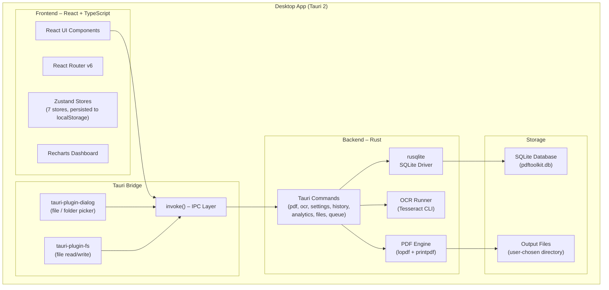
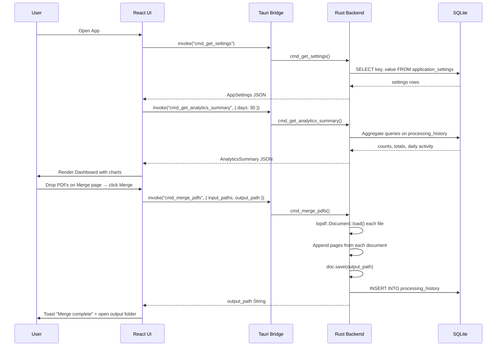
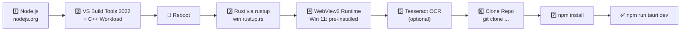

# pdf-toolkit

> **Offline-First PDF Management Suite** — A cross-platform desktop application built with React, Rust, Tauri, and SQLite.

Merge, split, compress, rotate, reorder, convert, protect, watermark, add OCR, and edit PDF files — all processed locally with zero cloud dependency. Inspired by iLovePDF, built for professionals who need complete privacy.

---

## Table of Contents

1. [Features](#features)
2. [Tech Stack](#tech-stack)
3. [Architecture Overview](#architecture-overview)
4. [Database Schema](#database-schema)
5. [Application Flow](#application-flow)
6. [Folder Structure](#folder-structure)
7. [Prerequisites & Installation (Step-by-Step)](#prerequisites--installation-step-by-step)
8. [Project Setup](#project-setup)
9. [Running in Development](#running-in-development)
10. [Building the Windows EXE](#building-the-windows-exe)
11. [UI Overview](#ui-overview)
12. [Tauri Commands Reference](#tauri-commands-reference)
13. [License](#license)

---

## Features

### Organize

| Feature | Description |
|---|---|
| 📎 **Merge PDF** | Combine multiple PDF files into one; drag-and-drop to reorder before merging |
| ✂️ **Split PDF** | Split by page ranges, fixed intervals, or extract all pages as individual files |
| 🗜️ **Compress PDF** | Reduce file size with Low / Medium / High / Maximum compression presets |
| 🔄 **Rotate PDF** | Rotate all or specific pages by 90°, 180°, or 270° |
| 📋 **Reorder Pages** | Drag pages into any order before saving |
| 🗑️ **Remove Pages** | Delete one or more pages from a PDF |
| 📤 **Extract Pages** | Pull out a subset of pages into a new document |
| 🔧 **Repair PDF** | Reload and re-save corrupt or malformed PDFs |

### Convert

| Feature | Description |
|---|---|
| 🖼️ **PDF → Image** | Export every page as PNG or JPEG |
| 📝 **PDF → Text** | Extract raw text content from a PDF |
| 🖼️ **Image → PDF** | Combine one or more images into a single PDF (via printpdf) |
| 📄 **Text → PDF** | Wrap plain text in a printpdf document |

### Security

| Feature | Description |
|---|---|
| 🔐 **Protect PDF** | Add a user/owner password with configurable permissions |
| 🔓 **Unlock PDF** | Remove password protection when you own the document |
| 💧 **Watermark** | Overlay text or image watermarks on all or specific pages |
| 🏷️ **Metadata Editor** | View and edit Title, Author, Subject, Keywords, Creator |

### Advanced

| Feature | Description |
|---|---|
| 🔍 **OCR** | Run Tesseract OCR on scanned PDFs; output as searchable PDF or plain text |
| 📊 **Analytics Dashboard** | Track operations, files processed, and storage saved over time |
| 🗂️ **History** | Full audit log of every operation with input/output paths and timestamps |
| ⚙️ **Batch Processing** | Queue multiple jobs and run them concurrently |

### Settings & Customisation

| Feature | Description |
|---|---|
| 🌙 **Dark / Light / System Theme** | Per-app theme toggle |
| 🎨 **Accent Colour** | Six palettes — rose, blue, violet, emerald, amber, indigo; applied live |
| 🗂️ **Collapsible Sidebar** | Collapse to icon-only mode for more canvas space |
| 📁 **Default Output Folder** | Configure where processed files are saved by default |
| 🔢 **Concurrent Jobs** | Set how many PDF operations run in parallel |
| 🌐 **OCR Language** | Choose Tesseract language pack (e.g. `eng`, `deu`, `fra`) |
| 🗃️ **Log Retention** | Configure how many days of history to keep |
| 💾 **Offline-First** | All data lives locally — no internet required |

---

## Tech Stack

| Layer | Technology |
|---|---|
| Frontend UI | React 18 + TypeScript |
| Styling | Tailwind CSS v3 (dark mode via `class` strategy) |
| Charts | Recharts |
| State | Zustand v5 (with `persist` middleware) |
| Routing | React Router v6 |
| Desktop Runtime | Tauri 2 |
| Backend Logic | Rust |
| Database | SQLite (bundled via `rusqlite`) |
| PDF Manipulation | lopdf 0.33 |
| PDF Creation | printpdf 0.7 |
| Image Handling | image 0.25 |
| OCR | Tesseract CLI |
| Date Utilities | date-fns v3 |
| Icons | Lucide React |
| Notifications | React Hot Toast |
| Build | Vite 5 |

---

## Architecture Overview



---

## Database Schema

```mermaid
erDiagram
    PROCESSING_HISTORY {
        INTEGER id          PK
        TEXT    operation   "merge | split | compress | rotate | ..."
        TEXT    input_files "JSON array of paths"
        TEXT    output_files "JSON array of paths"
        TEXT    status      "success | failed"
        INTEGER file_count
        INTEGER total_size  "bytes"
        INTEGER saved_size  "bytes saved (compress only)"
        INTEGER duration_ms
        TEXT    created_at  "datetime"
    }

    RECENT_FILES {
        INTEGER id         PK
        TEXT    path       "absolute file path"
        TEXT    name       "filename"
        TEXT    operation  "last operation performed"
        TEXT    opened_at  "datetime"
    }

    JOB_QUEUE {
        TEXT    id          PK "UUID"
        TEXT    operation
        TEXT    input_files "JSON array"
        TEXT    output_path
        TEXT    params      "JSON object"
        TEXT    status      "queued | running | completed | failed | cancelled"
        INTEGER progress    "0–100"
        TEXT    created_at
        TEXT    started_at
        TEXT    completed_at
        TEXT    error
        TEXT    result_files "JSON array"
    }

    APPLICATION_SETTINGS {
        TEXT    key         PK
        TEXT    value
        TEXT    updated_at
    }

    SAVED_WORKFLOWS {
        INTEGER id          PK
        TEXT    name
        TEXT    description
        TEXT    operations  "JSON array"
        TEXT    created_at
        TEXT    updated_at
    }

    USER_PREFERENCES {
        TEXT    key         PK
        TEXT    value
        TEXT    updated_at
    }

    AUDIT_LOGS {
        INTEGER id         PK
        TEXT    event_type
        TEXT    details    "JSON"
        TEXT    created_at
    }
```



---

## Application Flow



---

## Folder Structure

```
PDFToolKit/
├── src/                                   # React frontend
│   ├── app/
│   │   ├── DashboardPage.tsx              # Stats cards, AreaChart, PieChart, BarChart, recent files
│   │   ├── HistoryPage.tsx                # Operation audit log with delete / clear
│   │   ├── SettingsPage.tsx               # Theme, accent, output folder, OCR, concurrency
│   │   └── AboutPage.tsx                  # App info, tech stack, feature list
│   ├── layouts/
│   │   ├── MainLayout.tsx                 # App shell; injects theme class + accent CSS vars
│   │   ├── Sidebar.tsx                    # Collapsible nav with 6 sections + 23 items
│   │   ├── Header.tsx                     # Dynamic page title, theme toggle, running jobs badge
│   │   └── StatusBar.tsx                  # Status message + progress bar + version
│   ├── modules/
│   │   ├── merge-pdf/
│   │   │   └── MergePage.tsx              # Multi-file drop zone + reorder list
│   │   ├── split-pdf/
│   │   │   └── SplitPage.tsx              # Split mode selector (All / Ranges / FixedSize)
│   │   ├── compress-pdf/
│   │   │   └── CompressPage.tsx           # Compression level + result size stats
│   │   ├── organize/
│   │   │   ├── RotatePage.tsx             # Per-page or all-pages rotation
│   │   │   ├── ReorderPage.tsx            # Drag page thumbnails to reorder
│   │   │   ├── RemovePagesPage.tsx        # Select pages to delete
│   │   │   ├── ExtractPagesPage.tsx       # Pick pages to extract
│   │   │   └── RepairPage.tsx             # One-click PDF repair
│   │   ├── convert-pdf/
│   │   │   ├── PdfToPage.tsx              # PDF → Image / Text
│   │   │   └── ToPdfPage.tsx              # Image / Text → PDF
│   │   ├── security/
│   │   │   ├── ProtectPage.tsx            # Set user + owner passwords
│   │   │   ├── UnlockPage.tsx             # Remove password with owner key
│   │   │   ├── WatermarkPage.tsx          # Text / image watermark options
│   │   │   ├── MetadataPage.tsx           # View and edit PDF metadata fields
│   │   │   └── SignaturePage.tsx          # Digital signature (stub)
│   │   ├── ocr/
│   │   │   └── OcrPage.tsx                # Tesseract OCR with language + DPI options
│   │   ├── edit/
│   │   │   └── EditPage.tsx               # PDF editor (stub)
│   │   └── batch/
│   │       └── BatchPage.tsx              # Multi-operation job queue manager
│   ├── shared/
│   │   ├── components/
│   │   │   ├── Button.tsx                 # forwardRef; variants: primary/secondary/ghost/danger/outline
│   │   │   ├── Card.tsx                   # Card + CardHeader + CardTitle
│   │   │   ├── Badge.tsx                  # default/success/warning/error/info/brand
│   │   │   ├── ProgressBar.tsx            # Animated progress with variant colours
│   │   │   ├── Modal.tsx                  # Accessible dialog (Escape + overlay close)
│   │   │   ├── FileDropZone.tsx           # Tauri file dialog + HTML5 drag-and-drop
│   │   │   ├── PageHeader.tsx             # Icon + title + description + actions slot
│   │   │   ├── FileList.tsx               # FileListItem with status icons + remove button
│   │   │   ├── EmptyState.tsx             # Icon + title + description + action
│   │   │   └── Spinner.tsx                # Spinner + FullPageSpinner
│   │   ├── store/
│   │   │   ├── themeStore.ts              # Theme + accent colour; applies CSS vars live
│   │   │   ├── settingsStore.ts           # App settings persisted to localStorage
│   │   │   ├── fileStore.ts               # In-memory file list + selection state
│   │   │   ├── jobQueueStore.ts           # Active job tracking
│   │   │   ├── historyStore.ts            # History entries + recent files (partially persisted)
│   │   │   ├── analyticsStore.ts          # Analytics summary cache
│   │   │   └── appStore.ts                # Global status message + progress indicator
│   │   ├── types/
│   │   │   └── index.ts                   # All TypeScript types, enums, and DEFAULT_SETTINGS
│   │   └── utils/
│   │       ├── tauriCommands.ts           # All invoke() wrappers
│   │       ├── cn.ts                      # Tailwind class merger (clsx + twMerge)
│   │       ├── formatUtils.ts             # formatFileSize, formatDuration, operationLabel
│   │       └── fileUtils.ts               # generateId, isPdfFile, isImageFile, MIME constants
│   ├── styles/
│   │   └── globals.css                    # CSS variables (--bg-app, --text-primary, --accent-*), scrollbars
│   ├── App.tsx                            # React Router with 23 routes
│   ├── main.tsx                           # ReactDOM.createRoot + BrowserRouter + Toaster
│   └── test-setup.ts                      # @testing-library/jest-dom setup
│
├── src-tauri/                             # Rust / Tauri backend
│   ├── src/
│   │   ├── main.rs                        # Entry point — calls pdftoolkit_lib::run()
│   │   ├── lib.rs                         # Tauri Builder; plugin init; command registration
│   │   ├── error.rs                       # AppError enum + From impls for all error types
│   │   ├── pdf/
│   │   │   ├── mod.rs                     # Re-exports all PDF functions and types
│   │   │   ├── merge.rs                   # merge_pdfs() via lopdf
│   │   │   ├── split.rs                   # split_pdf() with SplitMode enum
│   │   │   ├── compress.rs                # compress_pdf() + CompressResult
│   │   │   ├── rotate.rs                  # rotate_pdf() with per-page or all-pages mode
│   │   │   ├── organize.rs                # reorder_pages(), remove_pages(), extract_pages()
│   │   │   ├── repair.rs                  # repair_pdf() — reload + re-save
│   │   │   ├── security.rs                # protect, unlock, watermark, get/set metadata
│   │   │   └── convert.rs                 # PDF↔Image/Text via lopdf + printpdf
│   │   ├── ocr/
│   │   │   └── mod.rs                     # perform_ocr() — Tesseract CLI wrapper
│   │   ├── commands/
│   │   │   ├── mod.rs
│   │   │   ├── pdf_commands.rs            # 16 PDF Tauri commands
│   │   │   ├── ocr_commands.rs            # cmd_perform_ocr
│   │   │   ├── settings_commands.rs       # cmd_get_settings, cmd_save_settings
│   │   │   ├── history_commands.rs        # History + recent files CRUD
│   │   │   ├── analytics_commands.rs      # cmd_get_analytics_summary (SQL aggregates)
│   │   │   ├── file_commands.rs           # Open file/folder, default output dir, thumbnail
│   │   │   └── queue_commands.rs          # Get/cancel/clear job queue
│   │   ├── database/
│   │   │   ├── mod.rs                     # DbState(Mutex<Connection>) + initialize_database()
│   │   │   └── migrations.rs              # run_migrations(); creates 7 tables with indexes
│   │   └── models/
│   │       ├── mod.rs
│   │       ├── history.rs                 # HistoryEntry struct
│   │       ├── settings.rs                # AppSettings struct + Default impl
│   │       ├── job.rs                     # Job struct
│   │       └── recent_file.rs             # RecentFile struct
│   ├── capabilities/
│   │   └── default.json                   # Tauri v2 permissions (shell, dialog, fs)
│   ├── icons/
│   ├── Cargo.toml
│   ├── build.rs
│   └── tauri.conf.json                    # Window 1400×900, identifier: com.pdftoolkit.app
│
├── index.html
├── package.json
├── tsconfig.json
├── vite.config.ts                         # Vitest config + path alias @ → ./src
├── tailwind.config.js                     # darkMode: "class" + CSS var brand colours
├── postcss.config.js
├── .gitignore
└── README.md
```

---

## Prerequisites & Installation (Step-by-Step)

Install the following tools **in the exact order listed below**. Each step must complete successfully before moving to the next.

---

### Step 1 — Node.js (v20 LTS or later)

**Why:** Runs the Vite dev server, npm scripts, and the Tauri CLI frontend build.

| | |
|---|---|
| **Download** | https://nodejs.org/en/download |
| **Recommended** | Node.js 20 LTS (Windows Installer `.msi`) |
| **Verify** | `node --version` → `v20.x.x` |
| **npm included** | `npm --version` → `10.x.x` |

**winget (alternative):**
```powershell
winget install --id OpenJS.NodeJS.LTS -e --accept-source-agreements
```

---

### Step 2 — Visual Studio Build Tools 2022 (C++ Desktop Workload)

**Why:** Rust compiles to native Windows code using the MSVC toolchain. The `link.exe` linker that ships with VS Build Tools is **mandatory** — VS Code alone is NOT sufficient.

| | |
|---|---|
| **Download** | https://visualstudio.microsoft.com/visual-cpp-build-tools/ |
| **Direct installer** | https://aka.ms/vs/17/release/vs_BuildTools.exe |
| **Verify after install** | Open **x64 Native Tools Command Prompt** and run `link` |

**During installation, select exactly this workload:**

```
☑  Desktop development with C++
      ☑  MSVC v143 – VS 2022 C++ x64/x86 build tools (Latest)
      ☑  Windows 11 SDK (10.0.22621.0) or Windows 10 SDK
      ☑  C++ CMake tools for Windows
```

**Silent install via winget (run as Administrator):**
```powershell
winget install --id Microsoft.VisualStudio.2022.BuildTools -e `
  --accept-source-agreements --accept-package-agreements `
  --override "--wait --quiet --add Microsoft.VisualStudio.Workload.VCTools --includeRecommended"
```

> ⚠️ **Reboot your machine after installing Build Tools** before continuing.

---

### Step 3 — Rust Toolchain (via rustup)

**Why:** The Tauri backend is written in Rust. `cargo` builds and bundles the application.

| | |
|---|---|
| **Download** | https://rustup.rs |
| **Windows installer** | https://win.rustup.rs/ (downloads `rustup-init.exe`) |
| **Minimum version** | Rust 1.77+ |

**Installation steps (Windows):**
```powershell
# Download and run the installer
# → Accept defaults (press Enter at each prompt)
# → Installer selects "x86_64-pc-windows-msvc" automatically when VS Build Tools is present

# After install, open a NEW PowerShell window, then verify:
rustup --version    # rustup 1.27.x
cargo --version     # cargo 1.77.x
rustc --version     # rustc 1.77.x
```

**If cargo is not found in PATH after install**, add it manually:
```powershell
$env:PATH += ";$env:USERPROFILE\.cargo\bin"
```

**Verify the MSVC target is active:**
```powershell
rustup target list --installed
# Expected: x86_64-pc-windows-msvc
```

---

### Step 4 — WebView2 Runtime

**Why:** Tauri uses Microsoft Edge WebView2 to render the React UI.

| | |
|---|---|
| **Windows 11** | Pre-installed — no action needed |
| **Windows 10** | Download from https://developer.microsoft.com/en-us/microsoft-edge/webview2/ |

```powershell
winget install --id Microsoft.EdgeWebView2Runtime -e --accept-source-agreements
```

---

### Step 5 — Tesseract OCR *(optional — only required for OCR features)*

**Why:** The OCR module shells out to the `tesseract` CLI. Without it, all other PDF tools work normally.

| | |
|---|---|
| **Download** | https://github.com/UB-Mannheim/tesseract/wiki |
| **Recommended** | `tesseract-ocr-w64-setup-5.x.x.exe` |
| **Verify** | `tesseract --version` |

After installation, ensure `tesseract` is on your system `PATH`.

To install additional language packs (e.g. German, French), download the corresponding `.traineddata` files from the [tessdata repository](https://github.com/tesseract-ocr/tessdata) and place them in the Tesseract `tessdata/` folder.

---

### Step 6 — Git (optional but recommended)

```powershell
winget install --id Git.Git -e --accept-source-agreements
```

---

### Prerequisites Summary Table

| # | Tool | Min Version | Download Link | Verify Command |
|---|---|---|---|---|
| 1 | Node.js | 20 LTS | https://nodejs.org/en/download | `node --version` |
| 2 | npm | 10.x | bundled with Node.js | `npm --version` |
| 3 | VS Build Tools 2022 (C++ workload) | 17.x | https://aka.ms/vs/17/release/vs_BuildTools.exe | `link` in x64 cmd |
| 4 | Rust (rustup) | 1.77+ | https://win.rustup.rs/ | `cargo --version` |
| 5 | WebView2 Runtime | latest | https://go.microsoft.com/fwlink/p/?LinkId=2124703 | pre-installed Win 11 |
| 6 | Tesseract OCR | 5.x | https://github.com/UB-Mannheim/tesseract/wiki | `tesseract --version` |
| 7 | Git | 2.x | https://git-scm.com/download/win | `git --version` |

---

### Installation Order Diagram



---

## Project Setup

### 1. Clone the repository

```bash
git clone https://github.com/siddhantpatni0407/PDFToolKit.git
cd PDFToolKit
```

### 2. Install Node.js dependencies

```bash
npm install
```

### 3. (Optional) Generate application icons

Place a 1024×1024 PNG icon at `app-icon.png` in the project root, then run:

```bash
npm run tauri icon app-icon.png
```

> For quick testing you can skip this — Tauri will use placeholder icons.

---

## Running in Development

```bash
npm run tauri dev
```

This will:
1. Start the Vite dev server on `http://localhost:1420`
2. Compile the Rust backend (`cargo build`)
3. Open the PDFToolKit desktop window with hot-reload

---

## Building the Windows EXE

### Full release build

```bash
npm run tauri build
```

The packaged installers will be at:

```
src-tauri/target/release/bundle/
├── nsis/
│   └── PDFToolKit_1.0.0_x64-setup.exe     ← NSIS installer
├── msi/
│   └── PDFToolKit_1.0.0_x64_en-US.msi     ← WiX MSI installer
└── pdftoolkit.exe                           ← Standalone executable
```

### Build for specific targets

```bash
# Windows x64 only
npm run tauri build -- --target x86_64-pc-windows-msvc

# Build without bundler (just the .exe)
npm run tauri build -- --bundles none
```

---

## UI Overview

### Dashboard (`/dashboard`)
- **4 KPI cards:** Total Operations, Files Processed, Storage Saved, Most Used Tool
- **Area Chart:** Daily operation activity over the last 30 days
- **Pie Chart:** Tool usage distribution
- **Bar Chart:** Operations breakdown by category
- **Recent Files:** Last 10 files processed with operation label and timestamp

### Merge PDF (`/merge`)
- Drop zone accepts multiple PDFs
- Drag file list items to change merge order
- Choose output file via native Save dialog
- Toast notification on completion with "Open Folder" shortcut

### Split PDF (`/split`)
- Three modes: **All Pages** (one PDF per page), **Page Ranges** (`1-3,5,7-9` syntax), **Fixed Size** (every N pages)
- Output directory chosen via native folder picker
- Lists all generated output files after completion

### Compress PDF (`/compress`)
- Four presets: **Low**, **Medium**, **High**, **Maximum**
- Displays original size → compressed size → savings percentage after processing

### Rotate PDF (`/rotate`)
- Rotate **All Pages** or **Specific Pages** (comma-separated page numbers)
- Rotation angle: 90° / 180° / 270°

### Reorder Pages (`/reorder`)
- Enter comma-separated page order (e.g. `3,1,2,4`) to rearrange pages

### Remove Pages (`/remove-pages`)
- Comma-separated list of page numbers to delete

### Extract Pages (`/extract-pages`)
- Comma-separated list of page numbers to extract into a new PDF

### Repair PDF (`/repair`)
- Loads the document with lopdf and re-saves it, fixing common structural issues

### PDF → Convert (`/pdf-to`)
- Output formats: **PNG**, **JPEG**, **Text**
- Each page exported as a separate image file

### → PDF Convert (`/to-pdf`)
- Input types: **PNG**, **JPEG**, **Plain Text**
- Images are wrapped in a printpdf document with configurable page size

### Protect PDF (`/protect`)
- Set a **User Password** (required to open) and/or **Owner Password** (required to modify)
- Permissions: print, copy, modify toggles

### Unlock PDF (`/unlock`)
- Provide the owner password to remove all restrictions

### Watermark (`/watermark`)
- **Text watermark:** Custom text, font size, opacity, rotation, colour, position
- **Image watermark:** Browse for image file, set opacity and position
- Apply to All Pages or specific page ranges

### Metadata (`/metadata`)
- Reads and displays: Title, Author, Subject, Keywords, Creator, Producer, Creation Date
- Editable fields saved back into the PDF

### OCR (`/ocr`)
- Language selector (Tesseract language code, e.g. `eng`, `deu`)
- DPI setting for scanned document quality
- Output type: **Searchable PDF** or **Plain Text**
- Requires Tesseract installed and on PATH

### History (`/history`)
- Full log of every completed operation
- Shows: operation type, file count, input/output paths, status badge, timestamp
- Delete individual entries or clear all history

### Settings (`/settings`)
- **Appearance:** Light / Dark / System theme + six accent colour palettes with live preview
- **Output:** Default output folder, auto-open after processing
- **Processing:** Max concurrent jobs (1–8)
- **Thumbnails:** Enable/disable, quality level
- **OCR:** Default language, engine path
- **Compression:** Default compression level
- **Privacy:** Log retention period (days)

---

## Tauri Commands Reference

All commands are in `src-tauri/src/commands/` and registered in `lib.rs`.

### PDF Commands

| Command | Parameters | Returns |
|---|---|---|
| `cmd_merge_pdfs` | `input_paths: Vec<String>, output_path: String` | `String` (output path) |
| `cmd_split_pdf` | `input_path, output_dir, options: SplitOptions` | `Vec<String>` |
| `cmd_compress_pdf` | `input_path, output_path, options: CompressOptions` | `CompressResult` |
| `cmd_rotate_pdf` | `input_path, output_path, options: RotateOptions` | `String` |
| `cmd_reorder_pages` | `input_path, output_path, page_order: Vec<u32>` | `String` |
| `cmd_remove_pages` | `input_path, output_path, pages: Vec<u32>` | `String` |
| `cmd_extract_pages` | `input_path, output_path, pages: Vec<u32>` | `String` |
| `cmd_repair_pdf` | `input_path, output_path` | `String` |
| `cmd_get_page_count` | `input_path: String` | `usize` |
| `cmd_convert_pdf_to` | `input_path, output_dir, options: ConvertOptions` | `Vec<String>` |
| `cmd_convert_to_pdf` | `input_path, output_path, options: ConvertOptions` | `String` |
| `cmd_protect_pdf` | `input_path, output_path, options: PasswordOptions` | `String` |
| `cmd_unlock_pdf` | `input_path, output_path, password: String` | `String` |
| `cmd_add_watermark` | `input_path, output_path, options: WatermarkOptions` | `String` |
| `cmd_get_metadata` | `input_path: String` | `PdfMetadata` |
| `cmd_set_metadata` | `input_path, output_path, metadata: PdfMetadata` | `String` |

### OCR Commands

| Command | Parameters | Returns |
|---|---|---|
| `cmd_perform_ocr` | `input_path, output_dir, options: OcrOptions` | `Vec<String>` |

### Settings Commands

| Command | Parameters | Returns |
|---|---|---|
| `cmd_get_settings` | — | `AppSettings` |
| `cmd_save_settings` | `settings: AppSettings` | `void` |

**Known `application_settings` keys:**

| Key | Type | Description |
|---|---|---|
| `theme` | `light` \| `dark` \| `system` | UI theme |
| `accent_color` | `rose` \| `blue` \| `violet` \| `emerald` \| `amber` \| `indigo` | Accent palette |
| `auto_open_output` | `true` \| `false` | Open output folder after processing |
| `show_thumbnails` | `true` \| `false` | Show PDF page thumbnails |
| `thumbnail_quality` | `low` \| `medium` \| `high` | Thumbnail render quality |
| `compression_level` | `low` \| `medium` \| `high` \| `maximum` | Default compression |
| `ocr_language` | Tesseract lang code | e.g. `eng`, `deu`, `fra` |
| `max_concurrent_jobs` | integer | Parallel job limit (1–8) |
| `log_retention_days` | integer | Days to keep history entries |
| `check_updates` | `true` \| `false` | Check for app updates on launch |
| `default_output_folder` | path string | Where processed files are saved |

### History & Recent Files Commands

| Command | Parameters | Returns |
|---|---|---|
| `cmd_get_history` | `limit: i64, offset: i64` | `HistoryEntry[]` |
| `cmd_delete_history_entry` | `id: i64` | `void` |
| `cmd_clear_history` | — | `void` |
| `cmd_get_recent_files` | `limit: i64` | `RecentFile[]` |
| `cmd_add_recent_file` | `path, name, operation: String` | `void` |
| `cmd_clear_recent_files` | — | `void` |

### Analytics Commands

| Command | Parameters | Returns |
|---|---|---|
| `cmd_get_analytics_summary` | `days: i64` | `AnalyticsSummary` |

### File Utility Commands

| Command | Parameters | Returns |
|---|---|---|
| `cmd_open_file` | `path: String` | `void` |
| `cmd_open_directory` | `path: String` | `void` |
| `cmd_get_default_output_dir` | — | `String` |
| `cmd_generate_thumbnail` | `input_path, page: u32, quality: String` | `String` (base64 or empty) |

### Job Queue Commands

| Command | Parameters | Returns |
|---|---|---|
| `cmd_get_jobs` | — | `Job[]` |
| `cmd_cancel_job` | `job_id: String` | `void` |
| `cmd_clear_completed_jobs` | — | `void` |

---

## Security

- All PDF processing is **100% local** — no files ever leave your machine
- Input paths validated against path traversal attacks (`..` and null-byte checks)
- Passwords are never written to the SQLite database or log files
- OCR language codes validated as alphanumeric + underscore only (prevents shell injection)
- SQLite WAL mode for data integrity
- Rust memory safety guarantees (no buffer overflows, no use-after-free)

---

## License

Siddhant Patni © pdf-toolkit Contributors

---

*Last updated: June 2026*
